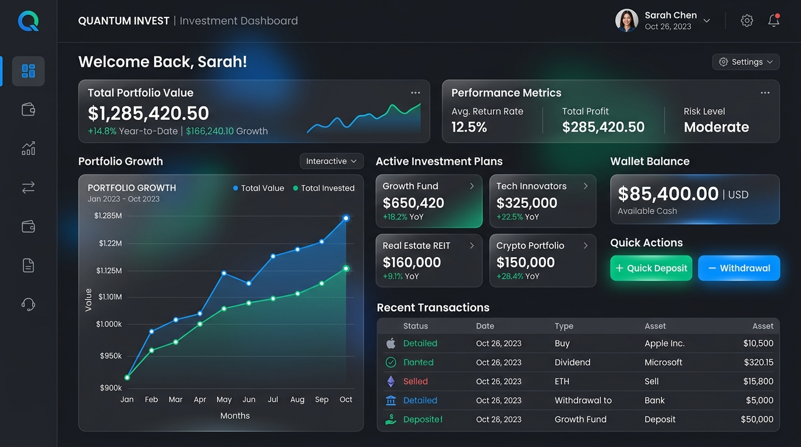
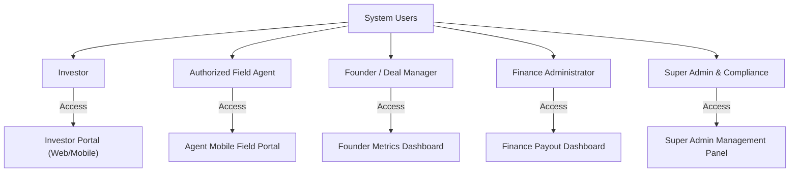
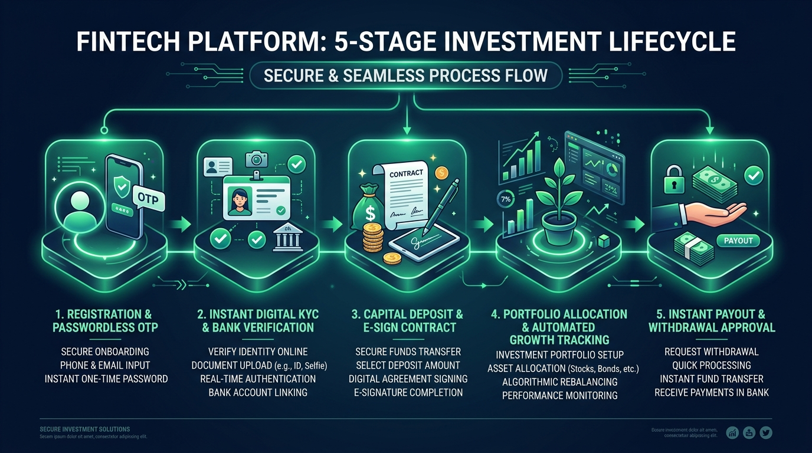
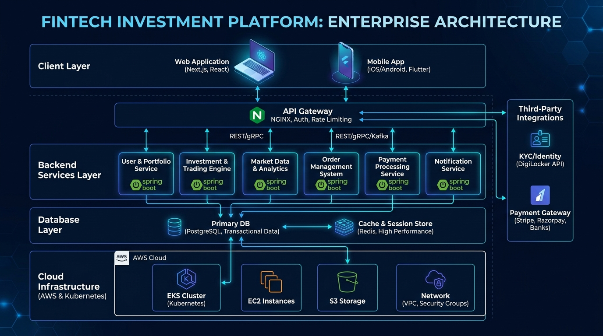
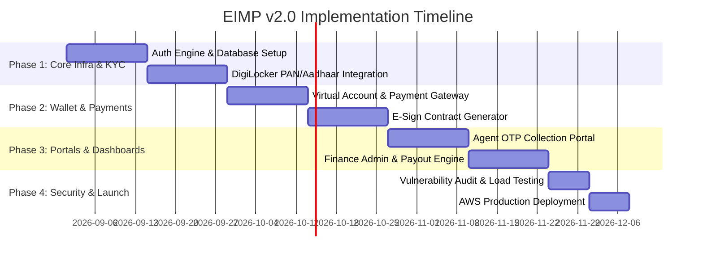

# IEEE Standard Software Requirement Specification (SRS)
## Enterprise Investment Management Platform (EIMP v2.0)

**Document Reference:** IEEE-29148-EIMP-2026-V2.0  
**Status:** Approved for Client Presentation & Engineering  
**Prepared for:** Kalpanaaa Software Solutions Pvt Ltd & Institutional Clients  
**Date of Release:** August 10, 2026  

---

> [!IMPORTANT]
> **REVISION NOTICE & COMPLIANCE ALIGNMENT (v2.0):**  
> This specification updates and replaces v1.0. All previous fixed-rate investment plans under the label of "Venture Capital" have been realigned into compliant **Debt Investment Slabs (RBI P2P/NBFC Aligned)** and **Syndicate Equity NAV Plans (SEBI Compliant)** to adhere strictly to SEBI AIF Regulations, RBI Financial Guidelines, and the Banning of Unregulated Deposit Schemes (BUDS) Act 2019.

---

## Executive Summary & System Overview

The **Enterprise Investment Management Platform (EIMP)** is an enterprise-grade, multi-tenant digital solution designed to streamline individual and corporate capital allocation, automated return distribution, and wallet payout management.



---

## Table of Contents
1. [1. Introduction](#1-introduction)
2. [2. Overall Description & User Roles](#2-overall-description--user-roles)
3. [3. End-to-End User Workflow & Process Lifecycle](#3-end-to-end-user-workflow--process-lifecycle)
4. [4. Functional Requirements (Core Modules)](#4-functional-requirements-core-modules)
5. [5. System Architecture & High-Level Design (HLD)](#5-system-architecture--high-level-design-hld)
6. [6. Data Schema & Database Design (LLD)](#6-data-schema--database-design-lld)
7. [7. Non-Functional & Security Requirements](#7-non-functional--security-requirements)
8. [8. Regulatory Compliance & Audit Matrix](#8-regulatory-compliance--audit-matrix)
9. [9. Project Deliverables & Phased Roadmap](#9-project-deliverables--phased-roadmap)

---

## 1. Introduction

### 1.1 Purpose
This Software Requirement Specification (SRS) document defines the complete functional, technical, architectural, and security requirements for the Enterprise Investment Management Platform (EIMP v2.0). It serves as the primary agreement between stakeholders, product owners, enterprise architects, software engineers, and compliance auditors.

### 1.2 Scope
EIMP provides a unified digital ecosystem supporting:
- Investor Onboarding with Instant Automated Digital KYC (PAN, Aadhaar e-KYC, Bank Penny-Drop).
- Multi-Tier Capital Allocation (Fixed Debt Slabs and Equity Syndicate NAVs).
- Virtual Account Wallet Management with instant automated payment reconciliation.
- Authorized Agent Field Portal with Tokenized OTP Verification to eliminate cash fraud.
- Multi-Level Payout & Withdrawal Approval Engine.
- Real-Time Founder & Finance Dashboards with Immutable Ledger Audit Trails.

### 1.3 Definitions & Abbreviations
- **SRS:** Software Requirement Specification (IEEE 29148 Standard).
- **RBAC:** Role-Based Access Control.
- **ACID:** Atomicity, Consistency, Isolation, Durability (Database Transaction Standards).
- **KYC/AML:** Know Your Customer / Anti-Money Laundering.
- **OTP:** One-Time Password (Tokenized Verification).
- **NAV:** Net Asset Value.
- **TDS:** Tax Deducted at Source (Indian Income Tax Act).

---

## 2. Overall Description & User Roles

### 2.1 User Classes & Access Permissions



| User Role | Interface | Core Responsibilities & Capabilities |
| :--- | :--- | :--- |
| **Investor** | Investor Portal | Complete Digital KYC, deposit funds via UPI/NetBanking, allocate capital, view daily growth, e-sign contracts, request withdrawals. |
| **Authorized Agent** | Agent Portal | Assist offline investors, initiate tokenized cash/cheque collection requests verified via mandatory investor OTP. |
| **Founder / Deal Lead** | Founder Dashboard | Submit pitch data, track total capital raised, publish quarterly performance disclosures, communicate with investors. |
| **Finance Admin** | Finance Portal | Verify offline bank deposits, approve pending withdrawal requests, review ledger reconciliations, download TDS/Tax reports. |
| **Super Admin** | Super Admin Panel | Global system configuration, manage investment plan slabs, assign RBAC permissions, audit immutable system logs. |

---

## 3. End-to-End User Workflow & Process Lifecycle



### 3.1 5-Stage Investment Lifecycle Breakdown
1. **Registration & Passwordless Auth:** User signs up using mobile number and email. Authenticated via high-security 6-digit OTP and JWT tokens.
2. **Automated Digital KYC Pipeline:** Instant PAN verification via NSDL, Aadhaar e-KYC via DigiLocker API, and Bank Account Penny-Drop verification.
3. **Wallet Deposit & E-Sign Contract:** User deposits funds into a dedicated Virtual Account via UPI or NetBanking. System automatically generates a digitally signed agreement (Aadhaar eSign).
4. **Capital Allocation & Portfolio Tracking:** Funds are allocated to selected investment plans. Daily/Monthly growth is computed automatically by the ledger engine.
5. **Automated Payout & Withdrawal Execution:** Investor requests payout ➔ System runs automated fraud scoring ➔ Finance Admin signs off ➔ Payment gateway auto-disburses funds to verified bank account.

---

## 4. Functional Requirements (Core Modules)

### 4.1 Module 1: User Onboarding & Mandatory Digital KYC
- **FR-1.1:** System MUST enforce mandatory passwordless mobile OTP authentication.
- **FR-1.2:** System MUST integrate NSDL/CERSAI APIs for instant PAN validation.
- **FR-1.3:** System MUST integrate Aadhaar OTP e-KYC via DigiLocker API.
- **FR-1.4:** System MUST perform instant bank account ownership verification via Penny-Drop API.
- **FR-1.5 (Strict Compliance Gate):** System MUST block all wallet deposit and investment features until user KYC status is set to `VERIFIED`.

### 4.2 Module 2: Digital Investment Wallet & Plan Engine
- **FR-2.1:** System MUST generate a dedicated Virtual Bank Account (via RazorpayX / Cashfree) for each verified user upon onboarding.
- **FR-2.2:** System MUST support configurable investment plans (Fixed Debt Slabs and Equity Syndicate NAVs).
- **FR-2.3:** System MUST execute atomic PostgreSQL transactions to prevent double-spending or balance lock inconsistencies.
- **FR-2.4:** System MUST auto-generate E-Signed Investment Agreements stored securely in Amazon S3 upon investment lock.

### 4.3 Module 3: Authorized Agent Tokenized Collection Workflow
- **FR-3.1:** Agents MAY initiate offline investment collection entries on behalf of investors.
- **FR-3.2:** System MUST trigger a unique 6-digit verification OTP to the investor's mobile number upon collection initiation.
- **FR-3.3:** Agent submission SHALL NOT be credited to the wallet unless the investor provides the OTP to confirm receipt of funds.

### 4.4 Module 4: Withdrawal & Payout Management
- **FR-4.1:** Investors MAY request partial or full withdrawal of matured capital and returns.
- **FR-4.2:** System MUST enforce multi-level approval matrix:
  - Amounts ≤ ₹50,000: Auto-processed via Payout API within 2 hours.
  - Amounts > ₹50,000: Require dual-level Finance Admin approval.
- **FR-4.3:** System MUST automatically deduct Tax Deducted at Source (TDS) according to Section 194A/194K of the Indian Income Tax Act before payout release.

---

## 5. System Architecture & High-Level Design (HLD)



### 5.1 Technology Stack Rationalization

| Layer | Selected Enterprise Technology | Technical Rationale |
| :--- | :--- | :--- |
| **Client Layer** | Next.js 14 (TypeScript), Tailwind CSS | Server-Side Rendering (SSR) for ultra-fast page load times, SEO optimized, unified TypeScript type safety. |
| **API Gateway** | Nginx / AWS API Gateway | Rate limiting, SSL/TLS termination, DDOS protection, CORS policy enforcement. |
| **Backend Microservices** | Java Spring Boot 3.x OR NestJS | High-throughput RESTful architecture, enterprise Spring Security / Passport JWT, asynchronous event processing. |
| **Relational Database** | PostgreSQL 16 | Strict ACID compliance for financial ledger, Row-Level Security (RLS), multi-version concurrency control. |
| **In-Memory Cache** | Redis 7 | High-speed session caching, distributed atomic locks, rate limiting. |
| **Storage & Cloud Infra** | AWS EKS, Amazon S3, RDS PostgreSQL | Containerized Kubernetes deployment, automated multi-region backup and disaster recovery. |
| **Integrations** | RazorpayX, DigiLocker, Amazon SES, Gupshup | Instant payment reconciliation, digital KYC verification, transactional emails and SMS. |

---

## 6. Data Schema & Database Design (LLD)

The database schema is designed in 3rd Normal Form (3NF) to ensure data integrity and prevent redundant storage across 30 core tables.

```mermaid
erDiagram
    USERS ||--o{ KYC_RECORDS : owns
    USERS ||--o{ BANK_ACCOUNTS : links
    USERS ||--o1 WALLETS : possesses
    WALLETS ||--o{ WALLET_TRANSACTIONS : logs
    USERS ||--o{ INVESTMENTS : places
    INVESTMENT_PLANS ||--o{ INVESTMENTS : defines
    INVESTMENTS ||--o{ RETURNS_LEDGER : yields
    USERS ||--o{ WITHDRAWALS : requests
    USERS ||--o{ AUDIT_LOGS : generates
```

### 6.1 Core Database Tables Dictionary

```sql
-- 1. USERS TABLE
CREATE TABLE users (
    user_id UUID PRIMARY KEY DEFAULT gen_random_uuid(),
    phone_number VARCHAR(15) UNIQUE NOT NULL,
    email VARCHAR(255) UNIQUE NOT NULL,
    password_hash VARCHAR(255) NOT NULL,
    user_type VARCHAR(20) CHECK (user_type IN ('INVESTOR', 'AGENT', 'FOUNDER', 'FINANCE', 'SUPER_ADMIN')),
    kyc_status VARCHAR(20) DEFAULT 'PENDING' CHECK (kyc_status IN ('PENDING', 'VERIFIED', 'REJECTED')),
    is_active BOOLEAN DEFAULT TRUE,
    created_at TIMESTAMP WITH TIME ZONE DEFAULT CURRENT_TIMESTAMP
);

-- 2. WALLETS TABLE (ACID Core)
CREATE TABLE wallets (
    wallet_id UUID PRIMARY KEY DEFAULT gen_random_uuid(),
    user_id UUID UNIQUE NOT NULL REFERENCES users(user_id),
    available_balance NUMERIC(15, 2) DEFAULT 0.00 CHECK (available_balance >= 0),
    locked_balance NUMERIC(15, 2) DEFAULT 0.00 CHECK (locked_balance >= 0),
    virtual_account_no VARCHAR(50) UNIQUE NOT NULL,
    updated_at TIMESTAMP WITH TIME ZONE DEFAULT CURRENT_TIMESTAMP
);

-- 3. INVESTMENTS TABLE
CREATE TABLE investments (
    investment_id UUID PRIMARY KEY DEFAULT gen_random_uuid(),
    user_id UUID NOT NULL REFERENCES users(user_id),
    plan_id UUID NOT NULL REFERENCES investment_plans(plan_id),
    principal_amount NUMERIC(15, 2) NOT NULL CHECK (principal_amount > 0),
    expected_return_rate NUMERIC(5, 2) NOT NULL,
    start_date DATE NOT NULL,
    maturity_date DATE NOT NULL,
    status VARCHAR(20) DEFAULT 'ACTIVE' CHECK (status IN ('ACTIVE', 'MATURED', 'CLOSED', 'CANCELLED')),
    created_at TIMESTAMP WITH TIME ZONE DEFAULT CURRENT_TIMESTAMP
);
```

---

## 7. Non-Functional & Security Requirements

> [!TIP]
> **Performance SLA:**  
> The system is architected to support **10,000 concurrent active users** with API response latency under **200 milliseconds** for 95% of database requests.

### 7.1 Security & Data Protection Standards
- **Data Encryption at Rest:** AES-256 bit encryption applied to PostgreSQL disk storage and Amazon S3 buckets.
- **Data Encryption in Transit:** TLS 1.3 enforced across all web, mobile, and API gateway communications.
- **Authentication & Authorization:** JWT signed with RSA-256 private keys; Granular Role-Based Access Control (RBAC).
- **OWASP Top 10 Mitigation:** Native protection against SQL Injection, Cross-Site Scripting (XSS), and Cross-Site Request Forgery (CSRF).

### 7.2 Reliability & Disaster Recovery
- **Uptime SLA:** 99.9% guaranteed uptime utilizing AWS Multi-AZ deployment.
- **Point-In-Time Recovery (PITR):** Automated hourly database snapshots with 35-day backup retention.

---

## 8. Regulatory Compliance & Audit Matrix

| Regulatory Authority | Applicable Regulation / Act | EIMP Platform Compliance Mechanism |
| :--- | :--- | :--- |
| **SEBI** | Alternative Investment Funds (AIF) / Syndicate Guidelines | Strictly prohibits unauthorized fixed returns under VC label; supports transparent NAV and equity share distribution. |
| **RBI** | P2P Lending / NBFC Directions | Restricts fixed return debt products to licensed P2P partner escrow accounts with automated reconciliation. |
| **Government of India** | Banning of Unregulated Deposit Schemes (BUDS) Act 2019 | Eliminates unregulated deposit schemes; mandates digital contract e-signing and immutable transaction receipts. |
| **FIU-IND** | Anti-Money Laundering (AML) & KYC Norms | Mandatory pre-investment Aadhaar e-KYC, PAN validation, and PEP (Politically Exposed Persons) screening. |
| **Income Tax Dept** | Section 194A / 194K Tax Deduction (TDS) | Automated TDS calculation and generation of Form 16A quarterly certificates for investors. |
| **MeitY** | Digital Personal Data Protection (DPDP) Act 2023 | Explicit user consent management, right to erasure, and local data residency within Indian data centers. |

---

## 9. Project Deliverables & Phased Roadmap



| Phase | Duration | Primary Focus Area | Key Deliverables |
| :--- | :--- | :--- | :--- |
| **Phase 1** | Weeks 1–4 | Core Infrastructure & Digital KYC | PostgreSQL Schema setup, JWT Authentication Engine, DigiLocker PAN/Aadhaar API integration. |
| **Phase 2** | Weeks 5–8 | Investment Wallet & Payment Engine | RazorpayX Virtual Accounts, Investment Plan allocation logic, Aadhaar eSign Contract engine. |
| **Phase 3** | Weeks 9–12 | Agent Field & Admin Dashboards | Tokenized Agent OTP collection workflow, Finance Admin payout portal, Founder analytics. |
| **Phase 4** | Weeks 13–14 | Security Audit & Production Launch | OWASP security audit, load testing (10k concurrent users), AWS production deployment. |

---

> **Document Approval:**  
> **Prepared By:** Lead Enterprise Architect & Technical BA  
> **Approved By:** Chief Technology Officer & Client Product Sponsor  
> **Client Presentation Copy — All Rights Reserved.**

